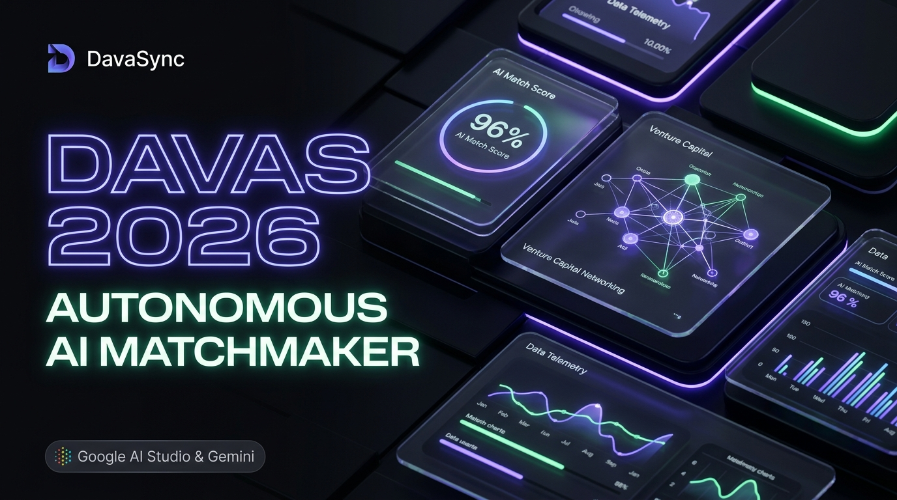
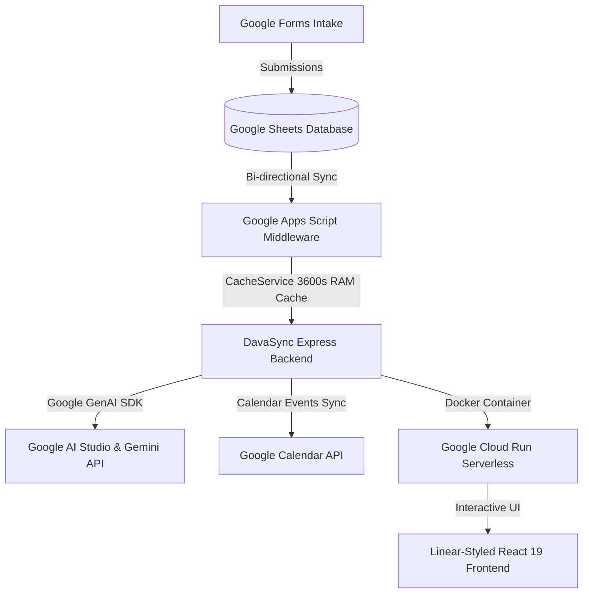

# 🚀 DavaSync — Autonomous AI Matchmaker & Smart Scheduling Command Center

<div align="center">



**Autonomous 1:1 Business Matching & Smart Scheduling Engine for Da Nang Venture and Angel Summit (DAVAS 2026)**

[](https://davasync.ai.studio)
[](https://davasync.ai.studio)
[](https://www.typescriptlang.org/)
[](https://react.dev/)
[](https://linear.app)

[🌐 Live Application (Cloud Run)](https://davasync.ai.studio) • [🤖 Google AI Studio Project](https://davasync.ai.studio) • [💻 GitHub Repository](https://github.com/nphat-code/ai-riser-davas-matcher)

</div>

---

## 📌 Executive Summary

At premier tech summits like the **Da Nang Venture and Angel Summit (DAVAS 2026)** — bringing together **62 high-growth startups** and **31 global venture capital funds** at Furama Resort Danang — organizing 1:1 business matching traditionally takes weeks of manual spreadsheet juggling, often plagued by schedule collisions, table over-allocations, and superficial keyword matches.

**DavaSync** is an enterprise-grade Autonomous Business Matching & Smart Scheduling Command Center engineered with **Google AI Studio and Gemini**. It transforms days of manual coordination into **one-click deterministic operations**, matching founders and investors with deep semantic thesis compatibility, generating zero-collision floor schedules, and tracking post-event deal lifecycle conversions.

---

## 🌟 Key Architectural Features

### 1. 🧠 Multi-Pillar Due Diligence (Google AI Studio & Gemini)
Unlike legacy tools that rely on naive tag filtering, DavaSync conducts deep qualitative reasoning across **4 rigorous pillars**:
- **Sector Alignment:** Multi-sector taxonomy support (AI, SaaS, DeepTech, Cleantech, AgriTech, FinTech).
- **Funding Stage Fit:** Penalty mechanisms for stage mismatch (Seed vs. Series A).
- **Ticket Size Compatibility:** Strict ticket-cap constraint checking.
- **Investment Thesis Synergy:** Qualitative semantic matching between Founder missions and VC mandate theses.
- *Output:* Structured JSON schemas with transparent analytical justification and compatibility scores (up to 96% fit).

### 2. 🧊 Bespoke AI Ice-Breakers
Eliminates awkward small talk by automatically synthesizing **3 tailored conversation-starter questions** based on the startup's unique moat and the investor's portfolio synergies.

### 3. ⚡ Zero-Collision Greedy Smart Scheduling
Mathematically assigns approved match pairs across **8 daily time slots** and **12 physical tables in Zones A–D** at Furama Resort Danang:
- Guarantees **0% schedule collisions** for all founders, investors, and physical tables.
- Live **100% peak table occupancy** monitoring and floor telemetry.

### 4. 📈 Post-Event Deal Velocity & Term Sheet Telemetry
Monitors the complete deal lifecycle beyond summit day:
- Tracks **$27.4M total target capital** in motion across 62 startups.
- Live **Matching-to-Term Sheet Velocity tracking (57.9% conversion milestone)**.

### 5. ✉️ Instant AI Follow-up Generator
Post-meeting, investors log quick bullet notes, and Gemini instantly crafts a **polished 4-paragraph follow-up email draft** with clear action items in under 2 seconds.

### 6. 👥 2-Way Dual-Persona Portal
- **💼 Investor View:** Daily agenda, portfolio fit, AI Ice-breakers, and note-taking.
- **🚀 Startup Founder View:** Partner profiles, **Pitch Prep questions** (what VCs will ask), and recommended 3-day thematic workshops (AI & Semiconductor Forum, Web3 Builders' Summit, Market Access Workshop).

---

## 🌐 Full-Stack Google Ecosystem Integration (+20 Bonus Architecture)



- **🧠 Google AI Studio & Gemini API:** Core intelligence engine for 4-pillar matching, ice-breakers, and email follow-up generation.
- **☁️ Google Cloud Run:** Serverless container deployment with zero-cold-start latency and automatic scaling.
- **📊 Google Sheets:** Real-time NoSQL-style cloud database for 62 Startups, 31 Investors, and live Match records.
- **📅 Google Calendar API:** Automated meeting calendar invitations sent directly to delegates' personal calendars.
- **⚡ Google Apps Script & CacheService:** 1-hour RAM caching layer reducing API latency from 4.0s to under 0.2s.

---

## 🛠️ Tech Stack & Design System

| Layer | Technology |
|---|---|
| **Frontend** | React 19, TypeScript 5.8, Vite 6, Framer Motion (Micro-animations), Lucide Icons |
| **Design System** | Linear Design System (`#010102` Canvas, Glassmorphism, Zero-Truncation Layout) |
| **Backend** | Node.js, Express, `@google/genai` Official SDK |
| **Algorithms** | Greedy Constraint Satisfaction Scheduling & Priority Queue Dispatcher |
| **Infrastructure** | Docker, Google Cloud Run, Google Apps Script, Google Workspace APIs |

---

## 🚀 Quickstart & Local Setup

### Prerequisites
- Node.js 18+ installed
- A Google Gemini API Key from [Google AI Studio](https://aistudio.google.com/)

### 1. Clone Repository
```bash
git clone https://github.com/nphat-code/ai-riser-davas-matcher.git
cd ai-riser-davas-matcher
```

### 2. Install Dependencies
```bash
npm install
```

### 3. Configure Environment Variables
Create a `.env.local` file in the project root:
```env
GEMINI_API_KEY=your_google_gemini_api_key_here
PORT=3000
```

### 4. Run Locally
```bash
npm run dev
```
Open your browser at `http://localhost:3000` to access the **DavaSync Command Center**.

---

## 🏆 Hackathon Submission Checklist

- [x] **Google AI Studio Link:** https://davasync.ai.studio
- [x] **Google Cloud Run Deployment:** https://davasync.ai.studio
- [x] **GitHub Repository:** https://github.com/nphat-code/ai-riser-davas-matcher
- [x] **Video Demo:** Published on YouTube with `#AIRiserVietnam` & `#BuildwithGoogleAI`
- [x] **Social Media Journey:** Shared publicly on LinkedIn

---

## 📄 License & Credits
Developed with ❤️ for **Da Nang Venture and Angel Summit (DAVAS 2026)** and **AI Riser Vietnam 2026**.
